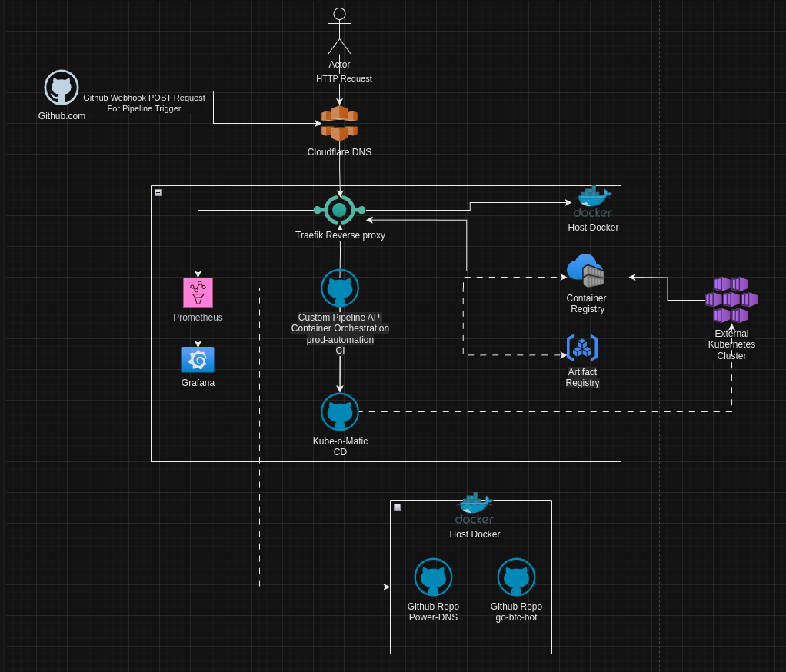

# Automagic DevOps Pipeline / Container as a Service

## Introduction

Welcome to the Automagic DevOps Pipeline -- your all-in-one solution for effortlessly automating the software development lifecycle! Say goodbye to manual build and deployment hassles, and hello to seamless CI/CD integration, Docker-powered containerization, and comprehensive logging and monitoring.

## Description

The Automagic DevOps Pipeline is your ultimate DevOps companion, designed to simplify and streamline your development process from start to finish. Whether you're a solo developer or part of a team, this platform empowers you to automate tedious tasks, accelerate delivery, and ensure consistent, reliable deployments every time.

## Architecture

* **Highlevel Design of the System.**
* feel free to open an ISSUE mentioning any problems or ideas you might have!

  

## Key Features

* **GitHub Webhook Integration:** Seamlessly trigger pipeline workflows with GitHub webhook events, ensuring your CI/CD processes kick off automatically with every code push.
  
* **Continuous Integration (CI):** Effortlessly build and test your applications on every commit, ensuring code quality and reliability before deployment.
  
* **Continuous Deployment (CD):** Automatically deploy your applications to production or staging environments after successful CI runs, with minimal manual intervention.
  
* **Logging and Monitoring:** Gain insights into your pipeline executions and application performance with robust logging and monitoring solutions, enabling proactive issue detection and resolution.
  
## Get Started

1. **Clone the Repository:** Get started by cloning the Automagic DevOps Pipeline repository to your local machine.

    ```shell
        git clone https://github.com/miladhzzzz/prod-automation
    ```

2. **Run Setup Script:** Execute the Makefile or init.sh script provided in the repository to automate the setup and initialization process.

    ```shell
        # Setting up the host if its freshly installed skip this whole section if you have docker / docker-compose / git installed!!
        make setup

        # or you can manually execute the setup-host.sh
        cd scripts
        chmod +x setup-host.sh
        ./setup-host.sh
    ```
  
3. **Deploy System Components:** Deploy the entire system, including Traefik reverse proxy, Grafana, Prometheus for observability, and the production automation container.

    ```shell
        # make up will build and run every component we need
        make up

        # you can alternatively run the production automation in stand alone mode with init.sh!
        # this will only run the python API application for development!
        chmod +x init.sh
        ./init.sh

        # OR
        make solo
    ```

4. **Kubernetes Integration:** You can integrate <https://github.com/miladhzzzz/kube-o-matic> in your deployment environment to automate CD for kubernetes!

    ```shell
        make cd
    ```

    * then send a POST request to /kubectl/config with your kubeconfig file and thats all you need to do!

5. **Utilize Docker Compose:** Use a `docker-compose.yml` in the root of your repository or a Dockerfile to build your project and define services.

    ```yaml
    # EXAMPLE YAML FILE FOR PROJECT AUTOMATION PIPELINE.
        version: '3.9'

        services:

           example-service:
            build:
              context: .
              dockerfile: Dockerfile

            ports: []
            # - "1111:1111"  # Adjust port if necessary
            labels: # Provide nescesary routing for traefik to pick up and automatically route to your service!
              - "traefik.enable=true"
              - "traefik.http.routers.example-service.rule=PathPrefix(`/api`)"
              - "traefik.http.middlewares.example-service.stripprefix.prefixes=/api"
              - "traefik.http.routers.example-service.middlewares=example-service@docker"
            volumes:
              - "/var/run/docker.sock:/var/run/docker.sock"

            networks:
            - prod-automation_prod-auto-inet

        networks:
        prod-automation_prod-auto-inet:
            external: true

    ```

6. **Track Pipeline Status:** Keep track of the pipeline status in a SQLite database for monitoring and reporting purposes.
  
7. **Set Environment Variables:** Use the API endpoint to set environment variables for projects, ensuring smooth application execution without manual intervention.
  
8. **Automate Build Triggers:** Trigger builds automatically when a webhook event is received, with the necessary environment variables pre-configured for seamless deployment.

## Experience the Magic

* **Push Code Changes:** Simply push your code changes to your GitHub repository.
  
* **Automated Workflows:** Watch as the Automagic DevOps Pipeline automates build, test, and deployment tasks seamlessly.
  
* **Monitor and Manage:** Keep tabs on your pipeline status and logs using the provided endpoints, ensuring smooth sailing throughout the development journey.

* **Version Control:** we Keep your projects updated using Git version control so you can easily revert breaking changes with a single GET request.

* **Reverse Proxy:** we also use Traefik reverse proxy you can set labels in your docker-compose to expose the services dynamically!.

* **Observability** we use Prometheus / Grafana to monitor the traefik entry point we also have a /prometheus config dir you can change it to observe all your containers or other components easily!
  
## Join the Journey

Ready to embark on a journey of automation and efficiency? Dive into the Automagic DevOps Pipeline, contribute your ideas, and let's make DevOps a breeze together!

## License

This project is licensed under the MIT License.
